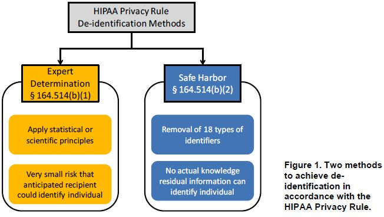
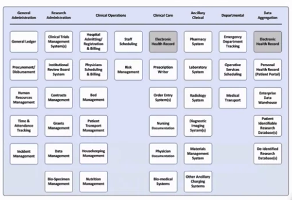
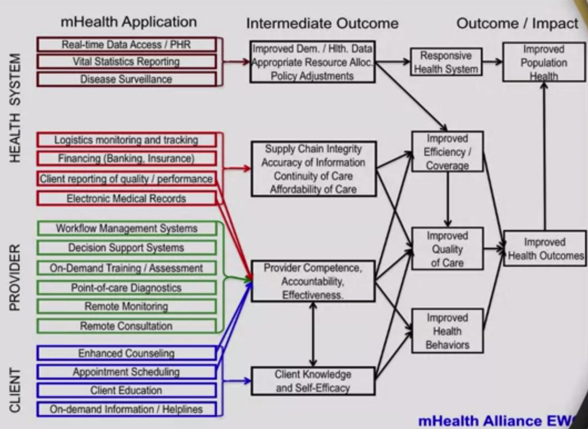

---
jupytext:
  text_representation:
    extension: .md
    format_name: myst
kernelspec:
  display_name: Data Management for Clinical Research 
  language: python
  name: python3
---

# Data Managemet for Clinical Research #

## I. Research Data Collection Strategy

### Clinical Research
- ***3 Categories***
    1. Patient-oriented research
    1. Epidemiological and behavior studies
    1. Outcomes research and health service research
- ***2 Types of Clinical Research Studies***
    1. Observational Studies -> `observe`
        - meaures exposures and outcomes
            - can be prospective or retrospective
        - no interventions
    1. Clinical Trials -> `intervene`
        - interventional study
            - how well new medical approaches work in people
            
### Data Management Lifecycle
- General Scope 
    1. Collection
    1. Representation
    1. Formatting
    1. Documentation
    1. Monitoring
    1. Access and Sharing
    1. Updates
    1. Security
    1. Quality Control
    1. Transformations
    1. Destruction
    
### HIPAA 18 Identfiers
1. Names;
2. All geographical subdivisions smaller than a State, including street address, city, county, precinct, zip code, and their equivalent geocodes, except for the initial three digits of a zip code, if according to the current publicly available data from the Bureau of the Census: (1) The geographic unit formed by combining all zip codes with the same three initial digits contains more than 20,000 people; and (2) The initial three digits of a zip code for all such geographic units containing 20,000 or fewer people is changed to 000.
3. All elements of dates (except year) for dates directly related to an individual, including birth date, admission date, discharge date, date of death; and all ages over 89 and all elements of dates (including year) indicative of such age, except that such ages and elements may be aggregated into a single category of age 90 or older;
4. Phone numbers;
5. Fax numbers;
6. Electronic mail addresses;
7. Social Security numbers;
8. Medical record numbers;
9. Health plan beneficiary numbers;
10. Account numbers;
11. Certificate/license numbers;
12. Vehicle identifiers and serial numbers, including license plate numbers;
13. Device identifiers and serial numbers;
14. Web Universal Resource Locators (URLs);
15. Internet Protocol (IP) address numbers;
16. Biometric identifiers, including finger and voice prints;
17. Full face photographic images and any comparable images; and
18. Any other unique identifying number, characteristic, or code (note this does not mean the unique code assigned by the investigator to code the data)

### Research Data Planning
1. Invest time in having Good Data Planning Upfront
    - garbage in - garbage out
1. Define all data you will collect before seing first research subject
    - ethics and study reliability
    - avoid inconvenience to participants
1. Alway follow Good Practice
    - develop primary hypothesis
    - define primary and secondary outcome measurements necessary to test hypothesis 
    - let your hypotheses shape your data collection strategy
    - by collecting about everything you will get nothing
    - come up with something small and build up and around it
    - don't go fishing when doing clinical study
    - think about 1-2 hypothesis that going to test definitely rather than full-fledge `collect everything and decide later`
    - be exact and discrete when defining variables
        - Blood pressure vs Systolic and Diastolic BP
        - Blood Surgar vs Metabolic Panel/Profile
    - review each measurement for best ***data type***
        - nominal vs categorical vs continuous
    - ***code categorical variables*** during data collection 
        - to limit choices 
        - don't code continuous variables
        - to lessen data cleaning
    - always include a set of ***confounding factors***
        - e.g. race, gender -> age, height, weight
        - e.g. height, weight -> BMI
    - store ***raw data fields*** rather than calculated values
        - e.g. age vs birthdate
    - allow possibility of ***missing data*** in fields
        - ***`develop codes for missing values`***
            - not applicable (000)
            - not collected (001)
            - doesn't remember (002)
            - will not disclose (003)
        - do not use physically possible values as the code
            - e.g. if age unknown, enter '99' - 99 can be a valid age
    - for quantitative study, minimize ***open-ended free-form text*** data entry 
    - develop standard operating procedure manuals
        - e.g. data collection forms should be reviewed prior to deployment
        - have practice data as test cases
        - perform full cycle test
    - form design should be iterative and targeted to make collecting easy
    - create security safeguards
        - do not email sensitive data with identifiers 
            - HIPAA identifiers have 18 points  
    - think of the data-sharing exchange policy
        - data dictionary (i.e. terminology and vocabulary) and SOP
    - enforce ***data integrity and validation***
        - form validation and field type check
        - check `double-data entry` or duplicate data
            - two members of the study team enter the same data for the same patient record. Their work is then compared for concordance.
        - keep audit trails of data changes
            - logs to record who and what
            
### Data Collection Modality
- Consideration
    1. Structure of Data
        1. Case Report Form
            - e.g. classic forms 
        1. Complex Machine-Captured Data
            - e.g. EEG, ECG, Radiology Images
        1. Unstructured data
            - e..g transcription, free-text
    1. Physical Location
        1. In Person data collection
            - who will do data entry
                - patient or study personel
            - e.g. routine visit vs dedicated visit
        1. Remote Data Collection
            - paper form
                - e.g. survey, buubles/scantron, OCR
            - electronic data capture (EDC)
                - e.g. browser, specialized software
            - phone
                - e.g. sms, interactive voice promopt/response
    1. Existing or New Data
        1. Re-using existing Data
            1. EMR
                - lab values, clinical notes
            1. previous studies
            1. registries and publicly available data

## II. Electronic Data Capture Fundamentals

### Standardization of Study Processes
- Processes
    1. Define Projects
        - What is the main priority of the project?
        - What outcomes trying to achieve?
        - What other general short/long term goals?
        - Who are the key personnel?
            - What are priorities for each person involved?
        - What are the project metrics that matter?
    1. Considering Standard Operating Procedure (SOP)
        - define the operational/technical components
        - identifying roadblocks and proactively developing solutions
        - hold personnel accountable
        - provide level of transparency
        - written SOP are expectations/requirements
    1. SOP Principles
        - use standard templates, don't reinvent
        - define workflow
        - use broad and generic appraoch that can apply to multiple projects whenever possible
        - don't be too specific 
        - don't set unrealistic standards
        - self-explanatory, standalone documents
            - can be used as training material
        - should be fluid document and reflect ever-changing processes
        - requires significant time and commitment
        - justifying unique process to external processes requires SOP
        - sign-off on all staff and authority
    1. Common SOP Topic Areas or Domain Areas
        1. Administrative
        1. Clinical Procedure and Workflow
        1. Data Management
        1. Laboratory
        1. Pharmacy

### Validated Instruments
- reusing the work of others, do not reinvent 
- leveraging work from others will save time and add credibility
- creating a new measurement method or instrumentation is a study in itself
- source of validated instruments
    - review of literature
    - consult of exports and collaborators
    
    
### Common Standard Terminologies

1. **CDISC** (Clinical Data Interchange Standards Consortium)
1. **LOINC** (Logical Observation Identifiers Names and Codes)
1. **Health Level 7** (HL7)
1. **ICD10/ICD9/ICD-0-3**
1. **SNOMED-CT** (Systematized Nomenclature of Medicine, Clinical Terms)

### Regulatory Compliance
1. High Level Regulatory Considerations when Managing Data
    1. **IRB** (Institutional Review Board)
        - human subjects protection
        - guiding principles
            1. respect for persons
                - autonomy, consent, dignity
            1. beneficence 
                - welfare or participants
                - risk/benfit
            1. justice
    1. **HIPAA** (Health Insurance Portability and Accountability Act)
        - USA centric
        - Rules
            1. privacy rule
            1. security rule
                1. administrative
                1. physical
                1. technical
    1. **FISMA** (Federal Information Security Management Act)
        - USA centric
1. High Level Regulatory Considerations for Electronic Data Systems
    1. **GCP** (Good Clinical Practice)
        - quality standards for designing, conducting and reporting trials
        - mandatory for FDA drugs and IND/IDE studies
        - core principles
            1. respect rights of participants
            1. conducting sound research
    1. **21 CFR - Part 11** (Code of Federal Regulations)
        - USA centric
        - applicability
            1. applicable when using records in electronic format in place of paper format
            1. applicable when using EMR as the main and only source document of patient record 
            1. applicable if for the first time the data are being generated and put directly to electronic system and there is no other source data

### Electronic Data Capture Fundamentals
- **REDCap** (Research Electronic Data Capture)
    - stemmed in 2004 from need to manage small/medium size non-trial research projects
    - de-identification process
        1. shifting dates of future dating
        1. identity obfuscation 

## III. Planning a Data Strategy for a Prosepective Study 

### Study Procedures: Morphine vs Marinol Study
- Planning a Strategy for EDC
    1. Review study from literature
        - design method and power calculation
    1. Brainstorm about data collection
        - baseline data and Demographics 
            1. look for confounding variables 
                - e.g. hair color vs pain threshold
            1. codify the variables 
            1. consider local context of the study in codification
                - e.g. hispanic vs non-hispanic option for south american study, 5 race options for global study
    1. EDC - create a project + data collection instruments
        1. define the data definitions
            - sample raw demographics forms
            
            
    1. EDC - finalize project design + ready the software
    1. EDC - export data + analysis scripting
    1. Review best practices principles
    
### Mid-Study Activities
- Changes after the initial implementation
    1.  Mid-study data changes
        - examples
            - new science related to study
            - natural events, lab burns, new administration
            - long-running longitudinal study (years)
            - 
        - solution
            - data versioning 
        - tips
            - do not recode options order and value
            - do not remove/delete data
            - be mindful about renaming data field values/codes
            - be mindful about changing meaning of data fields
            - be mindful about adding data
    1.  Interim Reporting Requirements 
        1. Single-Site Clinical Research Study
            - Sponsor (Funding Agency) 
                - Progress Reports
            - IRB Continuing Review (Typically Annual)
                - Participant Enrollment 
                    - to detect over-recruitment
                    - under-recruitment might trigger `stop discussion`
                        - i.e. low power statistical finding
                - Adverse Events
                - Safety Monitoring Rules
            - IRB Immediate Review
                - Adverse Events
                - Protocol Violation
                - Protocol Modifications
                - Key Study Personnel Changes
        1. Multi-Site Clinical Research Study
            - Similar to Single-Site basic reporting needs
            - Data Coordinating Center Operations Report
                - aggregate reporting across sites
                - all-site data audit and quality reporting
                - site assessment reports (recruitment/retnetion reports, deviations)
                
### Dimensions of Data Quality
- Common dimensions
    1. completeness
    1. conformity
    1. trust
    1. coverage
    1. consistency
    1. efficiency
    1. security
    1. timeliness
    1. meaningfulness
    1. scope
    1. precision
    1. conciseness
    1. flexibility
    1. clarity
    1. relevance
    1. accuracy
    1. format
    1. correctness
    1. duplication
    1. integrity
    1. concordance
    1. importance
    1. plausibility
    1. currency
    1. objectivity
    1. reputation
    1. transparency
    1. content
    1. free-of-error
    1. ease-of-use
  
### Design for Missing Data
- Common techniques
    1. don't allow blank fields
        - capture why a value is misisng
    1. accommodate the person entering the data and source of data
        - educational level of encoder, particpants, and study coordinator
    1. make survey easy and straightforward
    1. check blank values
    1. provide options like
        - for categorical variable
            - don't know
            - not applicable
            - decline to answer
            - pending
            - missing
            - missed/not done
            - unknown
        - for continuous variable
            - mapping code for impossible values (i.e. -99)
    1. design and pilto data entry forms
    1. validate surveys
    1. make allowance for `approximate data` 
        - chart abstraction
            - e.g. adverse event date
        - questions relying on patient recall
            - e.g. smoke per day
        - dates
    1. provide way for research to capture approxmiate information
    
### Data Quality Monitoring, Assurance, Audit
- Good Clinical Practice (GCP) assures
    - ensure scientific validity
    - increase public confidence
    - satisfy regulatory requirements
    - reduce future errors
- **2 Main Processes**
    1. Data Integrity Checking
        - `5% error rate` acceptable upper bound
        - checks elements in research are:
            - formatted
            - sensible
            - internally consistent
        - if data generates questionable reuslts:
            - investigate
            - document response
            - resolve/repeat
    1. Source Document Verfication
        - a.k.a `clinical research data auditing`
        - may capture 10x more data errors than integrity test
        - Basic Audit Procedures
            1. Select random records for auditing
            1. print dataset contents into paper audit forms
            1. visit audit site
            1. review available source documents
            1. note any data discrepancies
            1. conduct an exit interview for site personnel
            1. document findings and recommendations
        - ***European Organization for Research and Treatment of Cancer (EORTC) Data Discrepancies Category***
            - Code A error codes and Type
            | Error Code | Error Type |
            | --- | --- |
            |  1  |  None (correct)  |
            |  2  |  minor deviation |
            |  3  | incorrect        |
            |  4  | missing on form or database. |
            |  5  | data on form or database, not in file (no source document) |

## V. Posts-Study Activities

### Wrapping Up
1. Study Close-out Procedures 
    - prepare at the inception
    - no longer folowing up study subjects
    - no further work done
    - type of Study Close-out
        1. Scheduled
            - completed at xpected time
        1. Unscheduled
            - safety or validty concerns
            - interim results inconclusive
            - interim results are overwhelmingly positive
            - funding dries up
            - competing research is published
            - disasters
            - key personnel leave and cannot be replaced
    - Data Management for Close-out
        - keep checklist of data procedures
        - make sure all data are entered in database
        - run quality checks on data and query any erros
        - resolve all open data issues
        - forms are collected, completed and legible
        - lock the database
        - implement record retention
1. Record Retention and data Archival
    - What to keep
        - documents, electronic and paper
        - frozen versions of dataset
        - analysis scripts used in reports/publication
        - hardware/software required to read data
        - backups of files
    - How long to keep
        - varies to according to
            1. Good Clinical Practice
                - at least `2-3 years` 
            1. US Office for Human Research Protections
                - at least `3 years` 
            1. US FDA
            1. EudraLex (EU)
                - at least `5 years` 
            1. IRB
            1. Trial sponsor
            1. Institution
1. Data Destruction
    - authority sign-off
    - docment details of data destroyed
    - achive teh record destruction log
    - use confidential paper recycling service
    
### De-identifying Data
- **HIPAA methods**
    1. Expert Determination
    1. Safe Harbor Method
    
- **REDCap De-identifying methods**
    1. Known identifiers
        1. removal of known identifiers
        1. hashing the person identfier
    1. Free-form text
        1. removal of unvalidated text fields (text fields other than dates, numbers)
        1. removal of notes/essay box fields
    1. Date and datetime fields 
        1. removal of all date and datetime fields
        1. shifting of dates
- **Common De-identifying Techniques**
    1. Dates
        1. keeping year only
        1. shift dates by random intervals 
            - Steps of **Date Shifting Method**
                1. for each record, choose a random integer between 0 to 365
                   - use days in a year as intervals
                1. shift all dates in that record accordingly
                1. keep the date shifting keys (i.e. "secret key") or lookup table
                1. separate the process for ages 89 and above
            - `note`
                - doesn't require adding new types of variables to dataset and codebook
                - year only are excluded in HIPAA definition of date identifier
                - age 89 years - all elements (i.e. yyyy-mm-dd) are date identfier
                    - rationale: easier to identify fewer people 
                    - solution: group together as `90 and above`
        1. report time intervals
            - Steps of **Time Interval Method**
                1. choose and event to serve as baseline events
                    - e.g. study enrolment date
                1. for each record, calculate the numbers of days from baseline date to every other event date
                1. report these date intervals instead of actual dates
                1. paird dates can be converted to durations
                    - e.g. hospital admission date + discharge date == hospital duration stay
        1. report age at event
            - Steps of **Age at Event Method**
                1. calculate subjects exact age at each event
                1. report year of enrollment
                1. the dataset will only have eact age and year of enrolment, no dates

### Healthcare Information System Categories
- Categories
    1. General Administration
    1. Research Administration
    1. Clinical Operations
    1. Clinical Care
    1. Ancilliary Clinical
    1. Departmental
    1. Data Aggregation
    
    
### Imaging Data
1. Picture Archive and Communication System (PACS)
1. Digital Imaging Communications in Medicine (DICOM)
    - ISO 12052:2006
    
### mHealth 
1. Categories of mHealth
    - 
1. Considerations
    1. Security and Privacy
    1. Evidence of impact of mHealth Solution
    1. Scalability
    1. Interoperability
        - health information exchange
        - reporting to government
        - cross-cutting
    1. Cost, Payer vs Beneficiary
    1. Policy and Ethical considerations
    
### Data Management for Multi-center or Network based Studies
1. Team Roles 
    - Delegation Class
        1. Study Site
            - enrolling patient
            - gathtering data
        1. Operational Coordinating Center
            - Study Operations
        1. Data Coordinating Center
            - Managing Collection
            - Storage
            - Quality
            - Cleaning
            - Dissemination
1. Responsiblities
    - multiple instutitions
        - multiple IRB
        - multiple contracts/subcontracts
        - data use agreements
        - business associate agreements
        - certification of GCP
        - certification of Training
    - multiple site investigators 
        - data ownership
        - publication policies
        - scientific credit
        - sites
1. Logistics
    - randominization of subjects across centers
    - assignment of IDs (across sites) 
    - equipment and support
    - centralized training
    - user management and roles
    - data hosting and harmonization
        1. centralized 
            - pro: easy decision for trials
            - cons: 
                - difficult for pilot collaborations
                - giving up control of data
        1. decentralized
            - important use of single standard 
            - standardization of forms 
            - any versioning should propagate on multiple sites
1. Monitoring         
   - Monitoring Study Progress
   - Monitoring Data Completeness
   - MOnitoring Data QUality (Query Issuance and Resolution)
1. Data Quality
    - Freeze
    - Clean
    - De-identified
    - Disseminate for analysis/publication
   
   
1. Team Roles 
    - Delegation Class
        1. Study Site
            - enrolling patient
            - gathtering data
        1. Operational Coordinating Center
            - Study Operations
        1. Data Coordinating Center
            - Managing Collection
            - Storage
            - Quality
            - Cleaning
            - Dissemination
1. Responsiblities
    - multiple instutitions
        - multiple IRB
        - multiple contracts/subcontracts
        - data use agreements
        - business associate agreements
        - certification of GCP
        - certification of Training
    - multiple site investigators 
        - data ownership
        - publication policies
        - scientific credit
        - sites
1. Logistics
    - randominization of subjects across centers
    - assignment of IDs (across sites) 
    - equipment and support
    - centralized training
    - user management and roles
    - data hosting and harmonization
        1. centralized 
            - pro: easy decision for trials
            - cons: 
                - difficult for pilot collaborations
                - giving up control of data
        1. decentralized
            - important use of single standard 
            - standardization of forms 
            - any versioning should propagate on multiple sites
1. Monitoring         
   - Monitoring Study Progress
   - Monitoring Data Completeness
   - MOnitoring Data QUality (Query Issuance and Resolution)
1. Data Quality
    - Freeze
    - Clean
    - De-identified
    - Disseminate for analysis/publication
   
   
### Considerations for Resource-Limited Settings and Global Health
1. Understanding Settings
    - electricity, voltage flactuation can damage:
        - electrical equipment
    - internet availability can affect:
        - data entry
        - data sharing and reporting
        - training and meeting
        - monitoring
    - data environments
        - security
        - climate control
        - connectivity
    - shipping service
    - phone service
    - service may be
        - intermittent
        - slow
        - unreliable
        - not available
    - regulations
        - data privacy
        - data security
        - IRB
    - perssonnel
        - computer literacy
        - training
        - retention
    - language
    - timezones
    - attitude towards research
1. Rethink Data Collection Modalities
    - acquisition of equipment
    - powering of equipment
    - maintenance and repairs
    - sharing the data
    - training
    - appearance of wealth
    - local understanding and acceptance of technology
1. Redesigning Data Collection Forms
    - contextualize the environment
    - mother's name
        - as unqiue identifier
        
### Challenges of Collecting Data in Resource-Constrainted Settings 
1. Physical Challenges
    1. Electricty
        - power surges
        - frequent power outages and rolling blackouts
    1. Internet Access
        - intermittent and small bandwidth
    1. Geographical separation
    1. Building Infrastructure
1. Communication
    1. Language Barriers
        1. translation difficulties
            - use native speakers as data collectors
        1. lost in Translation
            - e.g. some countries don't have zipcode
1. Cultural Differences
    1. Collaborating (Personal Interaction)
    1. Planning
1. Educational Challenges
    1. Low Literacy Rates
    1. Research Training
        - qualified research partners
1. Data Quality
    1. In-person data audits
        - review of paper chart vs electronic records
1. Additional Recommendations

### Data Privacy and Data Use Agreement 
1. Privacy of data source
1. Ethics in sharing clinical data
1. Data use agreements (DUAs) or Data Transfer Aggrement or Data Access Aggreement
    - Elements
        1. description of the study
        1. description of scope of data use 
            - for single or multiple project
            - state who shared to be with anyone else
            - state procedures of termination
        1. statement of data ownership before, after completion of the project
            - state who owns the data
            - state what happents to data after study completion
        1. description of rights and obligations of parties in the agreement
    
## VI. Benefits, Scope, and Validated Instruments

### Survey Data Collection
- define, test, and validate instruments before launch
- **Survey Desing Process**
    1. define scope
        - define specific aims
        - define population of interest
        - define sample size
        - determine marketing strategy, e.g. incentives
        - anonymizing data collection
    1. consider existing instruments
        - review literature similar concepts
        - reuse existing instrument
        - ensure instrument validation is consistent with the study, population, modality, environment
    1. questionnaire planning and development
        - question should be concise and targeted to single concept
        - one question one concept 
        - relate questions directly to answering specific aims of study
        - avoid `nice to know` questions
            - prone to respondent fatigue
        - plan each wording
            - avoid acronyms
            - avoid jargon
            - use neutral and non biased  words
            - use short specific words
            - use familiar terms/concepts
        - plan question of recall
            - short series of related questions
            - focus on recent past
            - define reference time frame
                - e.g. during the last 8 days ...
        - grouping similar questions 
            - group demographics and sensitive questions
        - consider open/closed questions as appropriately
        - strucutre answers properly
        - include `Others (please satisfy)`
        - make questions and answers match
        - include units of measurement
            - e.g. how tall in centimeters
        - consider comon question types
            - e.g. checkboxes, radiobutton
        - consider visual analog scales
            - enables less respondent perception + memory bias in answer
            - e.g. pain scale, slider type bar
        - consider `Likert Scales`
            - should be `equi-distant`
            - e.g. Never, Very Rarley, Rarely, etc...
        - consider branching logic
            - decrease survey fatigue
            - increase data validity
    1. assembling teh data collection instrument
        - introduce survey with sufficient information, intent, and expectation
            - purpose of study 
            - time it will take
            - how data will be used
            - if identified/de-identified method
            - any incentive opportunities
            - any additional instructions needed
        - finish in respectful manner
            - thank the participant
            - review information about results dissemination
        - break up long survey into sections
            - section per page/web page
            - use branching logic
            - use progress indicator
         - consider formatting
             - large fontsize
             - high contrast
             - lots of white spaces
             - alignment consistency
             - space for answer in open-ended questions
    1. testing/refinement - pilot results
        - allow time for **usability testing**
            - evaluate the following
                - time required
                - readability and clarity
                - spelling and grammer
                - layout
                - general appearance
                - mutual exclusivity of respnose choices
                - lack of bias in questions
        - allow time for **functional testing**
            - evalute the following:
                - question flow
                - branching logic
                - user workflow - are testers following instructions?
                - data coding
        - allow time for **data testing**
            - evalute the following:
                - does every question relate to specific aims?
                - does question response make sense?
                - how many answers left blank?
                - how many questions answered `do not know`?
                - are testers completing the survey?
                - are answers consistent with branching logic?
                - is there variance in qudstions responses?
    1. survey administration
        - consider modes
            - paper, emr, sms
        - consider environment
            - waiting area, home/mail
        - consider invited participants
            - mail or hand delivery of instrument
        - consider open participation
            - stack of paper survey instrument with instruction
    1. data analysis
        - build electornic database platform to house collected data
        - build database platform at the beginning study
        - use practice data to test database
        - test full cycle data flow
            - pilot data collection -> database storage -> SPSS package -> Mock analysis

------------------------

## Resources
### Week 1 - Research Data Collection Strategy ###
- [HIPAA 18 identifiers](https://cphs.berkeley.edu/hipaa/hipaa18.html)

### Week 5 - Posts-Study Activities ###
- Paper
    - [Preparing raw clinical data for publication: guidance for journal editors, authors, and peer reviewers](https://www.bmj.com/content/340/bmj.c181)
    
### Week 6 -  Benefits, Scope, and Validated Instruments
- Paper
    - [Preparing raw clinical data for publication: guidance for journal editors, authors, and peer reviewers](https://www.bmj.com/content/340/bmj.c181)
    
