---
jupytext:
  text_representation:
    extension: .md
    format_name: myst
kernelspec:
  display_name: Computational Phenotyping 
  language: python
  name: python3
---

# Phenotyping #

## Resources ##
- Library 
    - [Phenotyping Public Library](https://phekb.org/phenotypes/)
- Phenotyping Study 
    - [Breast Cancer](https://phekb.org/phenotype/breast-cancer)
    - [Diabetes Mellitus](https://phekb.org/phenotype/type-2-diabetes-mellitus)

## I. Computational Phenotyping ##
### Definition ###
- automated process of creating algorithm to identify patient population

### Use Case ###
- since it is ineffecient to read all records individually to see particulary condition
> when we are creating a computational phenotyping algorithm we are doing so because we have a **large database to search that is simply to large to complete by hand**

### Overview ###
- focus on identifying 2 populations
    1. **Cases**
        - condition of interest
        - 2 types
            1. definite cases
                - algorithm defined
            1. possible  cases
                - needs to be manually reviewed
    1. **Controls**
        - algorithm defined
        
### Elements  ###
1. Population of Interest
    - e.g. Steroid induced osteonecrosis 
1. Inclusion Criteria
    - e.g. 
1. Exclusion Critiera
    - e.g. must not be heroine addict
1. Definition for Case/Controls
    - how to decide which definition to use
        - consider analytic goal
            - e.g. genetic risk factor
                - limiit population to those with laboratory evidence 
            - e.g. patient-level prediction
                - use availability and ease of use of data for easy deployment of model to other EHR

### Example ##
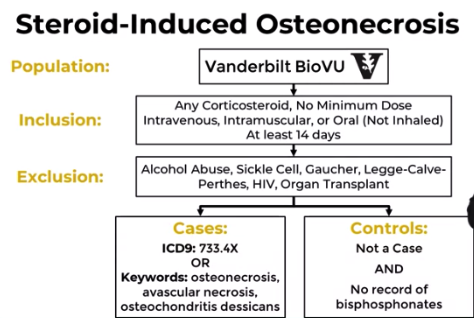

## II. Manual Record Review ##
- the gold standard
- the most important step in identifying population
- common practice when creating `Natural Language Processing` and validating clinical prediction models
- for checking the level of evidence
    - e.g. manual review for diabetes popluation
        - any mention in EMR?
        - self-reported history?
        - diagnosed or treated by endocrinology?
        - laboratory results only?
        - treatment only without diagnosis?
        - diagnosis critieria?
        - accpetable diagnostic test?
- ***3 Methods for Manual Review***
    1. creating review instrument
        1. write down all variables of importance
            - convert into survey questions 
                - to identify the data type and survey form
        1. review a few recrods
            - for real life context 
                - to find if information is available 
        1. refine and simplify instrument
        1. iterate the process
        1. use seucre data entry methods
            - use HIPAA compliant
            - use electronic data capture 
                - e..g RedCap, google forms
    1. developing review protocol
        - describe how to perform manual review
            - e.g. date of intake of date of record entry
        - create in parallel with review instrument
        - involve the entire review team
        - update review documents
            - living documents
        - have **interrater agreemt**
            - `Cohen's kappa statistics`
            - compute concordance rate
        - example
            - 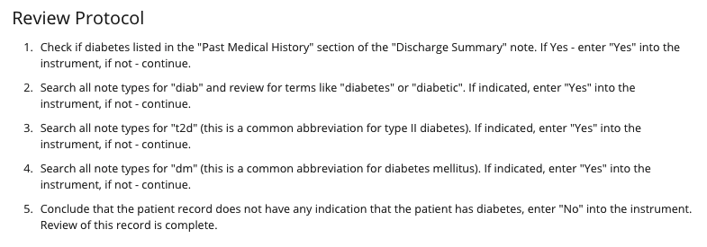
    1. assessing the quality of manual review

### 1. Selecting Reviewers and Records ###
#### a. Selecting Reviewer ####
- for Simple (validating existing diagnosis) 
    - with medical knowledge
    - one or two 
- for Complex (identifying new diagnosis)
    - advanced medical training
    - minimum of two
    
##### Reviewers Disagreement #####
1. Joint Review -> consensus
1. 3rd Reviewer
1. Expert Reviewer Designation

#### b. Selecting Records ####
- Gold Standard Technique
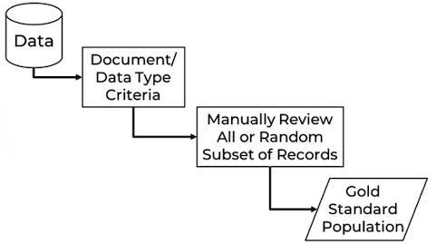

- Iterative Technique 
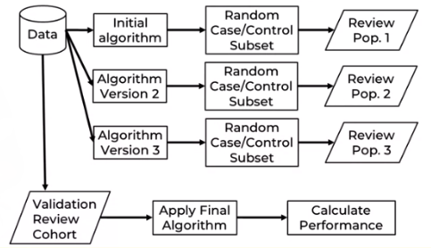

##### Comparing Technique #####
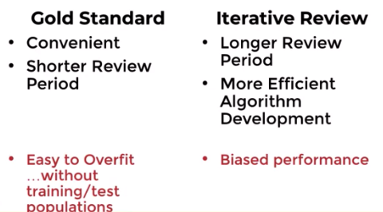

### 2. Tools and Techniques ###
1. Excel Method
    - recording case/control on excel and patient id

## II. Data Types ##
### Performance ###    
- Performance of algorithm can be measured by:
    1. Sensitivity
        - true positive rate
    1. Specificity
        - false positive rate
    1. Positive and negative predictive values
        -  tell us how well the test accurately assigned whether the patient has the condition
        1. Positive Predictive Value (PPV)
            - how likely is the patient actually have the disease?
            - show the `percent` of true positives from the total number of patients with the actual diagnosis
        1. Negative Predictive Value (NPV)
            - how likely is the patient actually do not have the disease?
            - show the `percent` of true negatives from the total number of patients without the actual diagnosis
    
- **Scenarios**
    1. ** Specific, Not Sensitive**
        - correctly identify only a few cases
        - lots of missed cases (missed true positives)
    1. ** Not Specific, Sensitive**
        - lots of false positive
        - capture a lot of the cases
        
### Different Types ###
1. **Billing Data**
    - the commonly used data vocabulary 
        1. procedure code (CPT)
            - **CONS**
                - may not be available
                    - handled by 3rd party outsourced billing agency - medical coders
                - **high specificity**
                    - if there are procedures only specific to a certain diagnosis
                        - e.g. clipping of aneurysm
                - **not sensitive**
                    - the codes only apply to patientes who recieved procedure at the specific health center
        1. diagnosis code (ICD)
            - **PROS**
                - most common data types for phenotyping due to::
                    - structure
                    - ease of use
            - **CONS**
                - have variable phenotyping peroformance
                    - e.g. diabetes
                        - very sensitive but not specific
                            - type I and type II are used interchangeably
                    - e.g. tobacco use  disoreder
                        - not sensitive but very specific
                            - only people with who have used tobacoo have the ICD codes
                - prone to **False Negatives** due to:
                    1. Outpatient visits only allowed 4 ICD codes
                    1. Professional Billers
                        - may choose code based on the reimbursement value more than the accuracy of diagnosis
                - prone to **False Positives** due to:
                    1. diagnostic process
                        - diagnosis evolves over time
                            - e.g. admitting diagnosis, final diagnosis, clinical diagnosis
                    1. data entry error 
                    1. wrong diagnosis entered for purpose
                        - due to billing and reimbursement urposes
                        > there are a number of medications tests and procedures that are only allowed for certain diagnoses. Providers may assign one of these codes to justify unnecessary procedure so that it is covered by insurance
1. **Laboratory Data**
    - **CONS**
        - American Diabetes Association requires `hemoglobin AiC level`
    - **PROS**
        - incorrect values upon entry
        - **high specificity**
            - when data are part of the diagnostic criteria
        - **variable sensitivity**
            - e.g. patient with diagnosis are no longer takes routine HbA1C
        - added complexity
            - combining single or panel test
                - e.g. glucose measurements order as single test or part of complex metabolic panel
        - assay and reference range changes
        - unit of measures may change
            - based on types of lab testing method or protocol
                - `resolution`: algorithm must include units of time, adjust as necessary
        - bias control definitions
            - having controls with negative HbA1c levels but have genetic predisposition for diabetes due to family history
1. **Clinical Observation**
    - **PROS**
        - useful since observation may be part as diagnositc criteria 
            - e.g. Hypertension and blood pressure
            - e.g. Pulmonary disease and lung function tests 
    - **CONS**
        - added complexities
            - different types of observations
                - Non-invasive vs invasive blood pressure
                - sitting vs lying vs standing
                - lower leg vs arms
        - accuracy errors
            - typographical errors
            - wrong measurement units
            - `resolution`: data cleaning
1. **Medications**
    - **PROS**
        - useful since treatment of disease may identify diagnosis
        - most prescription are in structured data
    - **CONS**
        - difficult to define therapy discontinuation
        - accurate dose amounts and scheduling
            - e.g. warfarin
                - have nine different pills with color coding
                - dose changes relative to how blood clots react until right effect is reached
        - multiple indications
            - off-label to treat other conditions
                - e.g. Spironolactone approved for CHF
                    - but may be use as anti-angiogenic effects
                - e.g. Viagra approved for high blood pressure
                    - but may be used as vasodilator
                - e.g. Metformin approved for diabetes
                    - but may be used for indiations of polycistic ovarian syndrome 
            - `resolution`: use only when in combination with other data types
 
## III. Data Manipulation ##

- `ever-never` cases
    - none or multiple instances of a single patient
    
### 3 Primary Types of Data Manipulation ###
- manipulating or querying the data as entry, exit, inclusin or exclusion criteria 
- different manipulations can be used in combination or permutation
    - e.g. a laboratory measurement over certain period that occur one month after intake of medication
- **3 Primary Types of Data Manipulation**
    1. **Frequency Manipulation**
        - applicable to chronic condition
        - count of records
        - **3 Types of Frequency Manipulation**
            > 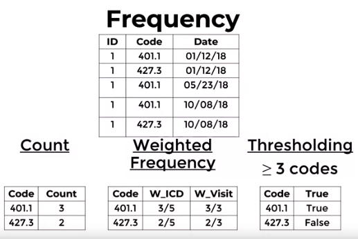
            1. Raw counts 
                - extremely popluar in machine learning
                    - may be bias algorightm towards patients with severe disease
                - `assumes linear increase in importance as more data is accumulated`
                - **mostly** used in billing
            1. Weighted frequency
                - **least** used in computational phenotyping
                - frequently used in machine learning
                - weight the value based on the total number of ICD codes or encounters the patient had or visit counts or total amount of care received
                - the denominator affects the interpretation
                - `adjust the counts based on how often patient uses healthcare`
            1. Threshold frequency
                - requires any particular data element to be present at some number of times either outside or within the pre-defined range
                    - e.g. requiring the minimum number of billing ocdes
                        - to reduce the likelihood of false positive
                - used when trying to deteremine the presence of disease or outcome
                - `assumes limited value from multiple measurements after a minimum frequency of that measurement has been reached`
    1. **Temporal Manipulation**
        > 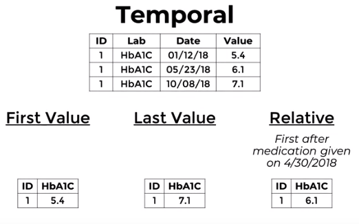
        - used more if looking for **sequence of events**
        - most straightforward manipulation method
            - use only first and last value
            - use timing of the event in relation to other data element
                - e.g. first lab value after medication prescription
    1. **Value Manipulation**
        > 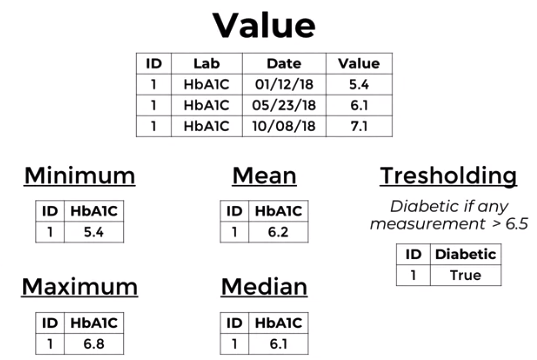
        - most common in **Laboratory and Observations**
        - allows you to consider the outcomes of multiple data points
        - **Types of Value Manipulation**
            1. traditional mathematical manipulations
                - e.g. mean, median, min, max value of multiple laboratory results
                    - mean prone to outliers
                        - `resolution`: use median
            1. value thresholding
                - if the measurement are outside or within the set range, then consider the value meaningful or not
                

## IV. Performance Evaluation ##
### 3 Criteria ###
1. Accuracy
1. Complexity
1. Portability

#### 1. Accuracy ####
1. High Specificity
    - acceptable to miss some true cases
    > 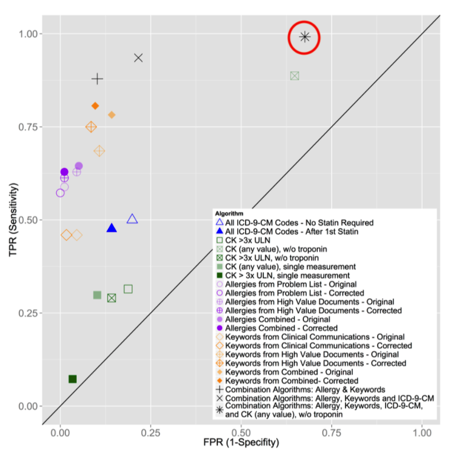
1. High Sensitivity
    - can be used to identify patients eligible for a study screening or public health intervention
    - used for disease with **high severity**
    - may have many false positives
    > 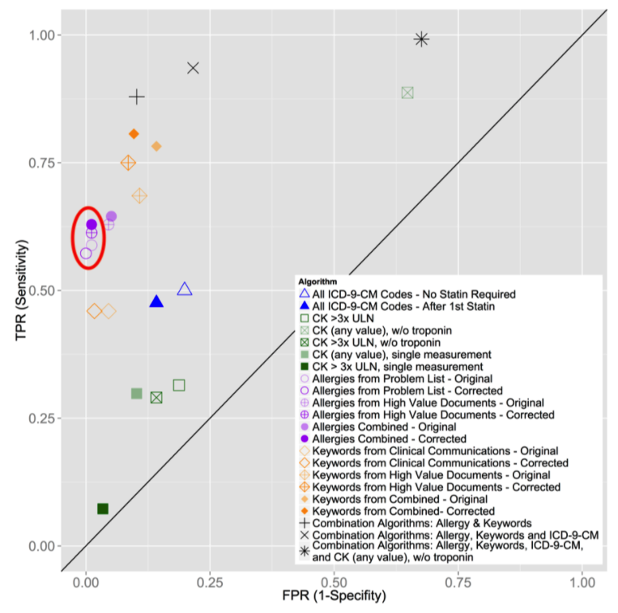
1. Balanced Performance
    - good balance of sensitivity and specificity
    > 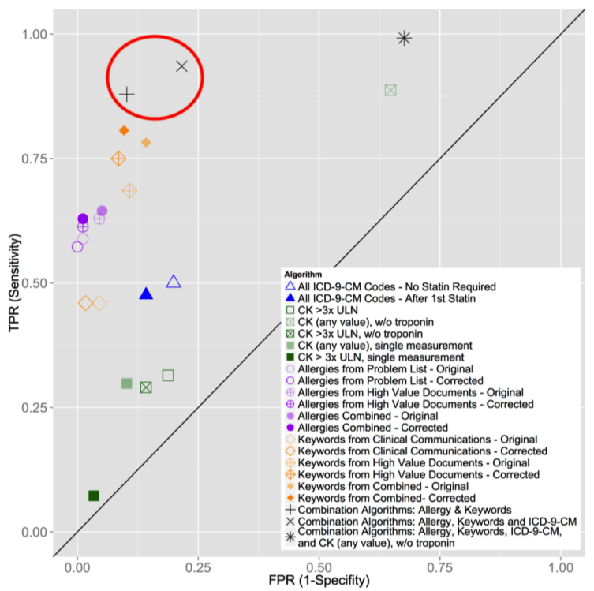
    
    
#### 2. Complexity ####
1. Algorithm Implementation Difficulty
1. Computation Time

#### 3. Portability ####
1. Availability of Data Types
    - use multiple types of data
    - full access to notes
1. Consistency of Data Values 
    - consistent laboratory procedures
    - consistent reference ranges 