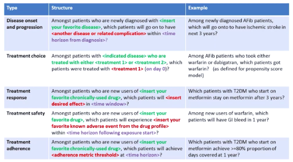

---
jupytext:
  text_representation:
    extension: .md
    format_name: myst
kernelspec:
  display_name: OHDSI Analytics 
  language: python
  name: python3
---

# OHDSI Analytics #

## USE-Case Driven ##
1. Use Case 1 - Drug utilization study
1. Use Case 2 - Drug and device safety study
1. Use Case 3 - Health Technology Assessment (HTA) study

## I. Clinical Characterization ##
### Methods of Characterization ###
1. **Database-level characterization**
    - summary statistics of data profile of database
    - include questions: 
        1. What is the total count of persons in this database?
        1. What is the distribution of age for persons?
        1. How long are persons in this database observed for?
        1. What is the proportion of persons having a 
            - treatment
            - condition
            - procedure
    - helps undderstand what data is missing in database
1. **Cohort characterization**
    - describes population in aggregate medical history
    - can be used for person-level drug utilization studies (DUS) to estimate the 
        - prevalence of indications & contraindications of a given treatment
1. **Treatment pathways**
    - describes sequence of interventions
    - pathways analysis provides important evidence about treatment utilization amongst a population
        -  this kind of analysis can describe 
            1. most prevalent first-line therapies utilized
            1. the proportion of persons that discontinue treatment
            1. switch treatments or augment their therapy. 
1. **Incidence**
    - measures occurence rate of a new **outcome** in a population during a time-at-risk (TAR)

### Definition of Clinical  Characterization ###

#### 1. **Clinical charaterization** ####
1. `generate descriptive statistics` - **Tally**
1. `What happened to them?`
1. practical applications
    1. clinical feasiblity
    1. treatment utilization
    1. drug utilization
    1. disease natural history
    1. quality improvement
1. can answer the following questions
    1. For patients newly diagnosed with atrial fibrillation, how many receive a prescription for warfarin?
    1. What is the average age of patients who undergo hip arthroplasty?
    1. What is the incidence rate of pneumonia in patients over 65 years old?
1. **typical characterization questions** are formulated as:
    1. How many patients…?
    1. How often does…?
    1. What proportion of patients…?
    1. What is the distribution of values for lab…?
    1. What are the HbA1c levels for patients with…?
    1. What are the lab values for patients…?
    1. What is the median length of exposure for patients on….?
    1. What are the trends over time in…?
    1. What are other drugs that these patients are using?
    1. What are concomitant therapies?
    1. Do we have enough cases of…?
    1. Would it be feasible to study X…?
    1. What are the demographics of…?
    1. What are the risk factors of…? (if identifying a specific risk factor, maybe estimation, not prediction)
    1. What are the predictors of…?
1. **desired output**
    1. Count or percentage
    1. Averages
    1. Descriptive statistics
    1. Incidence rate
    1. Prevalence
    1. Cohort
    1. Rule-based phenotype
    1. Drug utilization
    1. Disease natural history
    1. Adherence
    1. Co-morbidity profile
    1. Treatment pathways
    1. Line of therapy
#### 2. **Population-level effect estimation** ####
1. answering `casual inferences` - **Cause**
1. `What are the casual effects?`
    1. safety surveillance
    1. comparative effectiveness of medical interventions
1. can answer the following questions
    1. For patients newly diagnosed with atrial fibrillation, in the first year after therapy initiation, does warfarin cause more major bleeds than dabigatran?
    1. Does the causal effect of metformin on diarrhea vary by age?  
1. **typical population level questions** are formulated as:
    1. What is the effect of…?
    1. What if I do intervention…?
    1. Which treatment works better?
    1. What is the risk of X on Y?
    1. What is the time-to-event of…?
1. **desired output**
    1. Relative risk
    1. Hazards ratio
    1. Odds ratio
    1. Average treatment effect
    1. Causal effect
    1. Association
    1. Correlation
    1. Safety surveillance
    1. Comparative effectiveness
#### 3. **Patient-level prediction** ####
- developings `machine learning` - **Predict**
- `What will happen to me?`
    1. precision medicine
    1. disease interception
1. can answer the following questions
    1. For a specific patient newly diagnosed with major depressive disorder, what is the probability the patient will attempt suicide in the first year following diagnosis?
    1. For a specific patient newly diagnosed with atrial fibrillation, in the first year after therapy initiation with warfarin, what is the probability the patient suffers an ischemic stroke?
1. **typical patient level questions** are formulated as:
    1. What is the chance that this patient will…?
    1. Who are candidates for…?
1. **desired output**
    1. Probability for an individual
    1. Prediction model
    1. High/low risk groups
    1. Probabilistic phenotype
##### Types of Patient Level Prediction #####

