---
jupytext:
  text_representation:
    extension: .md
    format_name: myst
kernelspec:
  display_name: OHDSI Introduction
  language: python
  name: python3
---

# Real World Data and EHDEN #

## Sources
### Paper ###
- **Clinical Characterization** 
    - [Characterizing treatment pathways at scale using the
OHDSI network](https://www.pnas.org/content/pnas/113/27/7329.full.pdf)
- **Population Level Effect Estimation**
    - [Improving reproducibility by using high-throughput observational studies with empirical calibration](https://www.ncbi.nlm.nih.gov/pmc/articles/PMC6107542/)
- **Patient Level**
    - [Design and implementation of a standardized framework to generate and evaluate patient-level prediction models using observational healthcare data](https://www.ncbi.nlm.nih.gov/pmc/articles/PMC6077830/)
- **TRANSMART** 
    - [tranSMART: An Open Source Knowledge Management and High Content Data Analytics Platform](https://www.ncbi.nlm.nih.gov/pmc/articles/PMC4333702/)
- **CodeMapper**
    - [CodeMapper: semiautomatic coding of case definitions. A
contribution from the ADVANCE project](https://core.ac.uk/download/pdf/158599285.pdf)

### Topics ###
- [Generating real-world evidence](https://rwe-navigator.eu/use-real-world-evidence/generate-real-world-evidence/)
- [Health Data Governance - Privacy, Monitoring and Research](http://www.oecd.org/publications/health-data-governance-9789264244566-en.htm)

### Framework ###
- [FAIR principle](https://www.go-fair.org/)

### Organizations ###
- **EHR4CR** [Using electronic health records for clinical research: The case of the EHR4CR project](https://www.sciencedirect.com/science/article/pii/S1532046414002263?via%3Dihub)
- [European Institute for Innovation through Health Data](https://www.i-hd.eu/)
- [European Medical Information Framework (EMIF)](http://www.emif.eu/)
    
### Company/Service Providers for Clinical Trials ###
- [Custodix](https://www.custodix.com/index.php)
- [Trinetx](https://trinetx.com/)
- [Directory List of Providers](https://www.ehden.eu/business-directory/)

### Dataset ###
- [OHDSI Data](https://data.ohdsi.org/)

### OHDSI Sample Study ###
- [Opioid use, postoperative complications, and implant survival after unicompartmental versus total knee replacement: a population-based network study](https://data.ohdsi.org/UkaTkaSafetyEffectiveness/)

### Platform ###
- [InSite](https://www.insiteplatform.com/)
    - clinical trial platform
- [Teamwork](https://www.teamwork.com/)
    - document sharing repository
- [TaskA](https://bioinformatics.ua.pt/taska/login?nextPath=%2Ftaska)
    - project management account
- [IMI Catalogue of tools](https://www.imi.europa.eu/projects-results/catalogue-project-tools)
    - IMI tools
- [TransMart Article](https://data.aetionomy.scai.fraunhofer.de/story/transmart-clinical-data-repository)
- [TransMart github](https://github.com/transmart-foundation/transmart-core/)
- [TransMart service provider](https://thehyve.nl/solutions/transmart)
- [European Medical Information Framework (EMIF) Cohort Catalogue](https://emif-catalogue.eu/index)
    - cohort groups
- [Research Data Management Tools](https://www.go-fair.org/resources/)
    - Data stewardship and management plan
   
### ODHSI Tools ###
- [OHDSI Methods Library](https://www.ohdsi.org/methods-library/)
    - R packages
- [EHDEN OHDSI ARACHNE](https://www.ohdsi.org/wp-content/uploads/2015/04/OHDSI_Odysseus_ARACHNE_Platform.pdf)
    - Network layer in OHDSI

### Websites ###
- [Real World Evidence Navigator](https://rwe-navigator.eu/)

## OMOP CDM ##

> OMOP data model design is driven by improving health thru generating evidence
- other data model are driven to represent the data fully (e.g. openEHR)
    - for storage purposes

## Real-World Evidence (RWE)
- evidence obtained from real world data (RWD)
    - which are observational data obtained during routine clinical practice
    - generated by
        - electronic health records (EHR)
        - medical claims
        - billing activities databases
        - registries
        - patient-generated data
        - mobile devices
        

### 4 Keys issues of RWE
1. Data Interoperability
    - structures
    - terminilogies
    - languages
1. Standardized analytical pipeline
1. Data network
    - network services
    - data partners
1. Strong Community

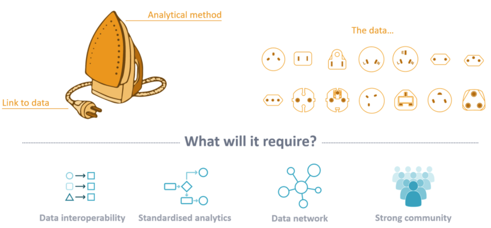

## Randomised Control Trial (RCT)
> Conventional randomised controlled trials (RCTs) alone may not provide very good evidence of the relative effectiveness of a new medicine 

> RCTs may be possible to generate **earlier** estimates of the relative effectiveness of the new medicine

> RCT alone cannot provide sufficient data for informed healthcare decision in some siutations.

> Measuring the impact of risk minimisation measures is challenging and using randomized trials to establish the relative effectiveness of different measures would not be ethical once a drug safety risk is identified.

- RWE capture the use of medical treatments in real-life settings when randomization to placebo for clinical trials may be:
    - impossible
    - impractical
    - unethical
    - unfeasible
    - `commorbidities`
    - need external validation
    - RCT may be compromised by very controlled and restricitive criteria

- RCT remains the gold standard

## Observational Study Hierarchy ##
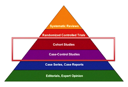

## Real-World Data (RWD)
- is an overarching term for data on the effects of health interventions 
    - such as benefits
    - risks 
    - resource use
    - pharmacovigilance
        - Periodic Benefit-Risk Evaluation Report
        - Periodic Safety Update Report
        - Vaccine Adverse Event Reporting System
- that are not collected in the context of  `conventional randomised controlled` trials (RCTs).
- can be collected
    - prospectively 
        - experimental study designs
    - retrospectively (problematic)
        - observational data 
            - observational research is more critical and problematic when it comes comparing the efficacy and safety of treatment of medication
            - but is gold standard for observing something as it happens to a population
                - e.g. observing who in the market place taking the medication in the market
                - e.g. treatment patterns and pathways
        - data from *routine clinical care*
- may include 
    - clinical 
    - economic outcomes
    - patient-reported outcomes
    - health-related quality of life
    
## RWD applications ##
1. When RCT is impossible
    > e.g. no randomised controlled trial of parachutes use, the basis for parachute use is purely observational
1. The data is out there
1. External validity

## RCT exceptions ##
- examples that RCT cannot be used
1. lack of evidence on certain subgroups
1. adherence and persistence in actual price
1. On vs off label-use
1. Risk minimization effectiveness/measures
    
## RWD sources ##
- can be obtained from
    1. structured studies
        - [experimental study designs](https://rwe-navigator.eu/use-real-world-evidence/generate-real-world-evidence/)
        - observational study designs
    1. additional sources
        - patient registries
            - [European Cystic Fibrosis Society Registry](https://www.ecfs.eu/ecfspr)
        - electronic health records
        - pharmacy and health insurance databases
            - [Sentinel Intiative](https://www.fda.gov/safety/fdas-sentinel-initiative)
            - [EHDEN (European Health Data and Evidence Network) project](https://www.ehden.eu/#)
        - social media
            - [PatientsLikeMe](https://www.patientslikeme.com/)
            - patient powered research networks
        - patient powered research networks
            - [PatientsLikeMe](https://www.patientslikeme.com/)
            - [PCORNET (Patient-Centered Outcomes Research Institute)](https://pcornet.org/)
            - [Accelerated Cure Projects](https://www.acceleratedcure.org/)

## RWD types (i.e. Observational Data)
1. Population
    - pediatric vs elderly
    - socioeconomic disparities
1. Care Settings
    - inpatient vs outpatient
    - primary (general practitioner) vs secondary care (specialist)
1. Data Capture process
    - administrative claims (insurance)
    - electronic health records
    - clinical registries
1. Health System
    - insured vs uninsured
    - country policies

## RWD Analytics Use Cases 
1. **Clinical charaterization**
    1. `generate descriptive statistics` - **Tally**
    1. `What happened to them?`
    1. practical applications
        1. clinical feasiblity
        1. treatment utilization
        1. drug utilization
        1. disease natural history
        1. quality improvement
    1. can answer the following questions
        1. For patients newly diagnosed with atrial fibrillation, how many receive a prescription for warfarin?
        1. What is the average age of patients who undergo hip arthroplasty?
        1. What is the incidence rate of pneumonia in patients over 65 years old?
    1. **typical characterization questions** are formulated as:
        1. How many patients…?
        1. How often does…?
        1. What proportion of patients…?
        1. What is the distribution of values for lab…?
        1. What are the HbA1c levels for patients with…?
        1. What are the lab values for patients…?
        1. What is the median length of exposure for patients on….?
        1. What are the trends over time in…?
        1. What are other drugs that these patients are using?
        1. What are concomitant therapies?
        1. Do we have enough cases of…?
        1. Would it be feasible to study X…?
        1. What are the demographics of…?
        1. What are the risk factors of…? (if identifying a specific risk factor, maybe estimation, not prediction)
        1. What are the predictors of…?
    1. **desired output**
        1. Count or percentage
        1. Averages
        1. Descriptive statistics
        1. Incidence rate
        1. Prevalence
        1. Cohort
        1. Rule-based phenotype
        1. Drug utilization
        1. Disease natural history
        1. Adherence
        1. Co-morbidity profile
        1. Treatment pathways
        1. Line of therapy
1. **Population-level effect estimation**
    1. answering `casual inferences` - **Cause**
    1. `What are the casual effects?`
        1. safety surveillance
        1. comparative effectiveness of medical interventions
    1. can answer the following questions
        1. For patients newly diagnosed with atrial fibrillation, in the first year after therapy initiation, does warfarin cause more major bleeds than dabigatran?
        1. Does the causal effect of metformin on diarrhea vary by age?  
    1. **typical population level questions** are formulated as:
        1. What is the effect of…?
        1. What if I do intervention…?
        1. Which treatment works better?
        1. What is the risk of X on Y?
        1. What is the time-to-event of…?
    1. **desired output**
        1. Relative risk
        1. Hazards ratio
        1. Odds ratio
        1. Average treatment effect
        1. Causal effect
        1. Association
        1. Correlation
        1. Safety surveillance
        1. Comparative effectiveness
1. **Patient-level prediction**
    - developings `machine learning` - **Predict**
    - `What will happen to me?`
        1. precision medicine
        1. disease interception
    1. can answer the following questions
        1. For a specific patient newly diagnosed with major depressive disorder, what is the probability the patient will attempt suicide in the first year following diagnosis?
        1. For a specific patient newly diagnosed with atrial fibrillation, in the first year after therapy initiation with warfarin, what is the probability the patient suffers an ischemic stroke?
    1. **typical patient level questions** are formulated as:
        1. What is the chance that this patient will…?
        1. Who are candidates for…?
    1. **desired output**
        1. Probability for an individual
        1. Prediction model
        1. High/low risk groups
        1. Probabilistic phenotype
        
## USE-Case Driven
1. Use Case 1 - Drug utilization study
1. Use Case 2 - Drug and device safety study
1. Use Case 3 - Health Technology Assessment (HTA) study

## Types of Patient Level Prediction ##

## Reliable RWE 
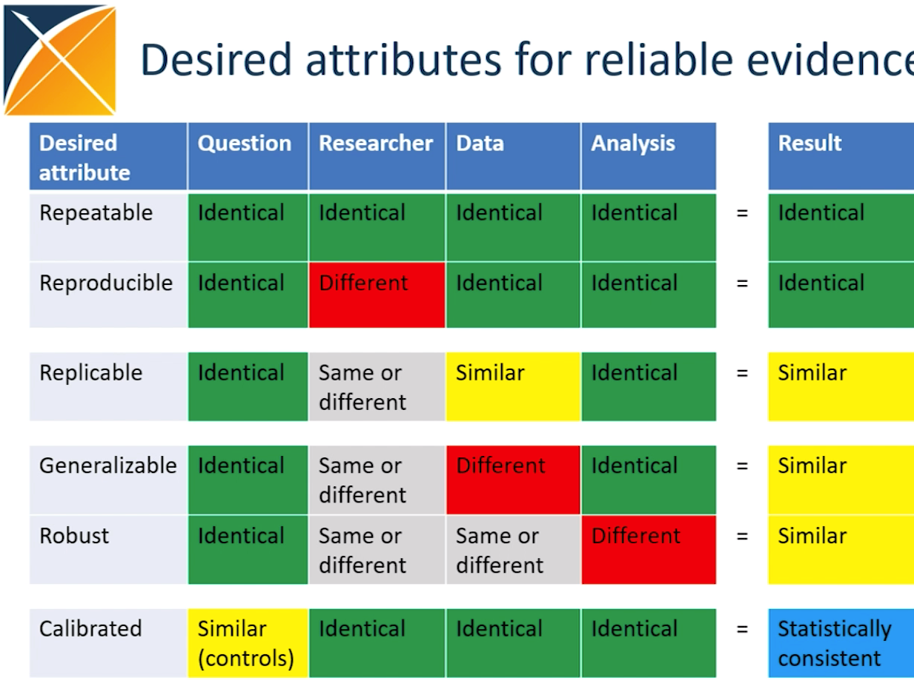

## EHR4CR
- **Electronic Health Record for Clinical Trial**
    - robust and scalable platform that can utilise de-identified data from hospital EHR systems
    - benefits
        - improve the efficiency of designing and conducting clinical trials 
        - reducing time and costs
        - reducing administrative burdens
        - optimising protocol feasibility assessments
        - accelerating patient recruitment
        - making study conduct more efficient
        - enabling the participation of European hospitals in the more clinical trials and thereby potentially increasing research income.
    - technical overview
        - supports distirbuted querying
            - to assist clinical trials feasiblity assessment
                - refine selection site study
                - locate the most relevant hospital sites
            - patient recruitment
                - trial sponsor to predict eligible patients
        - connect to multiple hospital EHR systems
            - within federated natwork
        - connect to data warehouses
    - privacy overview
        - **patient level data never leaves the connected hospital**
        - `privacy by design`
        - the script execution is performed completely by data partner
        - **Arachne** is a tool that:
            - send study request to data partners
            - send actual executable code
            - code can be reviewed by custodian before execution
            - the data custodian can review the results of the study before uploading the results into Arachne
        
## EHDEN Landscape ##
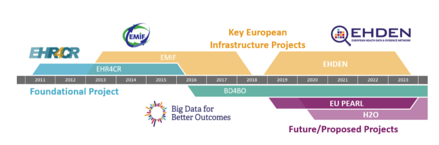

## EHDEN Mission ##
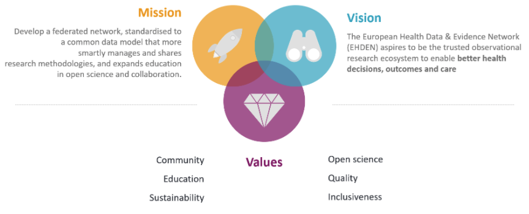

## EHDEN Objectives ##
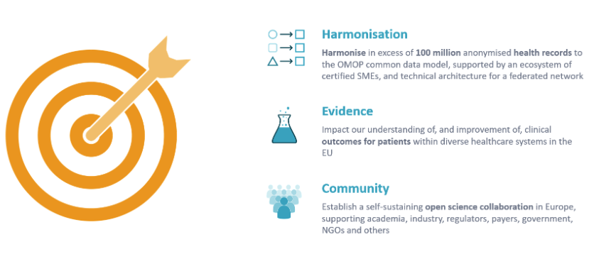

## EHDEN Keywords ##
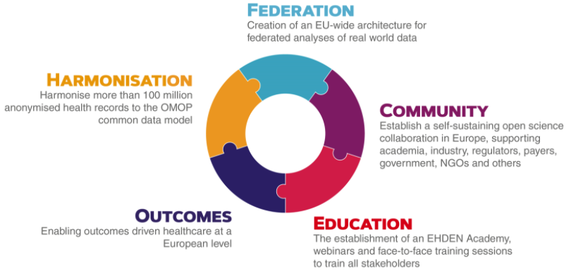

## EHDEN Platform ##
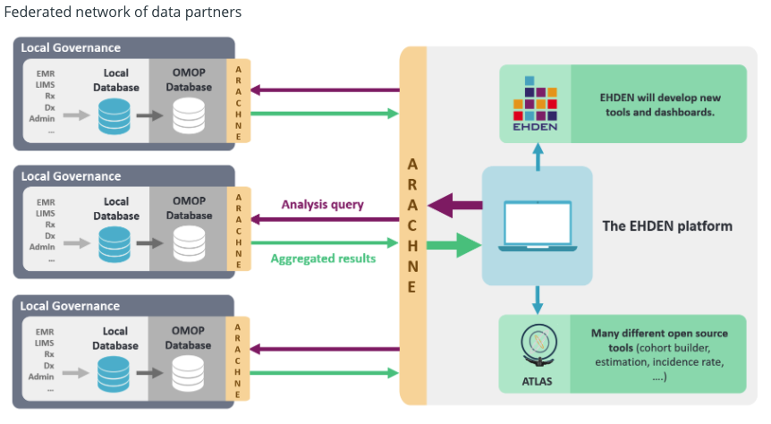

## EHDEN Governance ##
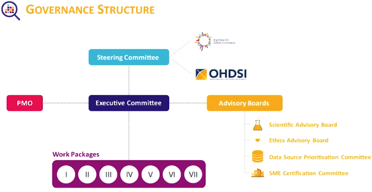

## EHDEN Work Packages ##
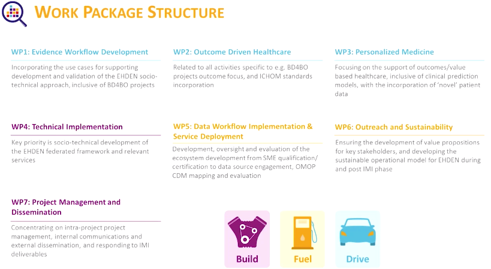

## EHDEN Analytics ##
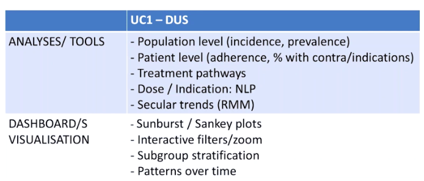