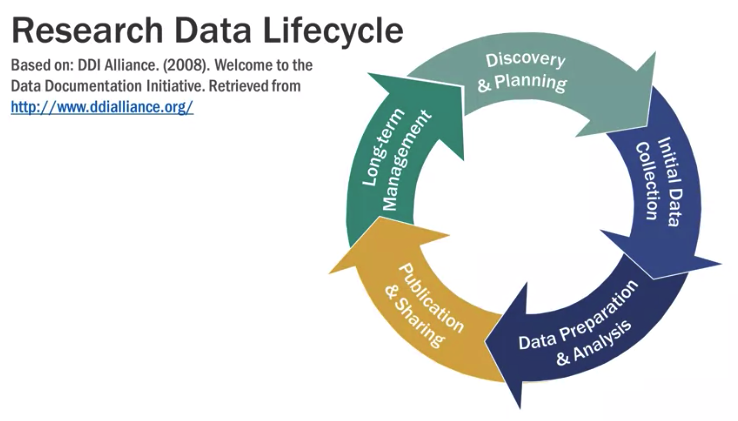
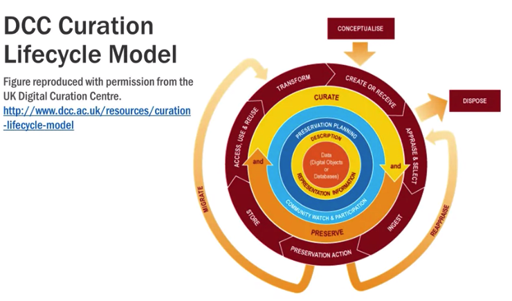
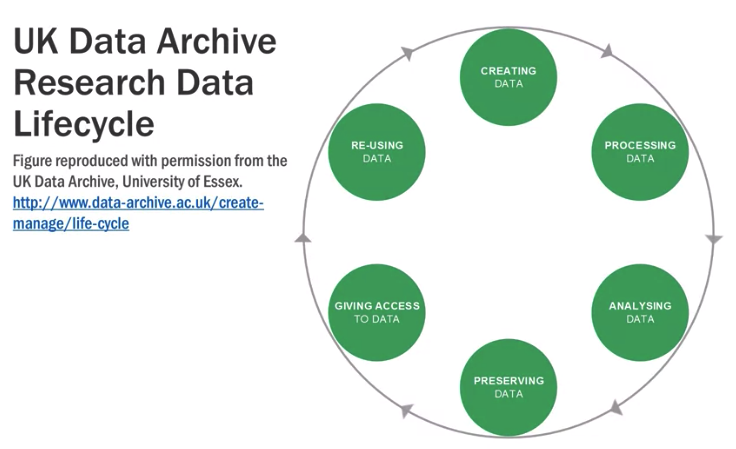

---
jupytext:
  text_representation:
    extension: .md
    format_name: myst
kernelspec:
  display_name: Research Data Management 
  language: python
  name: python3
---

# Research Data Management #

## Resources ##
- Tutorials
    - [MANTRA Research Data Management Training](https://mantra.edina.ac.uk/)
- Metadata standards 
    - [Dublin Core](http://dublincore.org/)
    - [Data Document Initiative](https://ddialliance.org/)
- Data Catalog Sample
    - [DDI](https://ddialliance.org/training/getting-started/data-catalogs)
- Research Data Repositories
    - [Harvard Dataverse](https://dataverse.harvard.edu/)
    - [Dryad Digital Repository](http://datadryad.org/)
    - [Odum Institute Dataverse](http://arc.irss.unc.edu/dvn/)
    - [Australian Data Archive](https://www.ada.edu.au/)
    - [Registry of Research Data Repository](http://www.re3data.org/)
- Data Management Plan Content
    - [Digital Curation Checklist](https://www.dcc.ac.uk/sites/default/files/documents/resource/DMP/DMP_Checklist_2013.pdf)
- Data Management Plan Tools
    - [Public DMP](https://dmponline.dcc.ac.uk/public_plans)
    - [Free DMP Tool](https://dmptool.org/get_started)
    
## I. Understanding Research Data ##
    
### Data Management ###
- Definition
    - activities/practices that support `long-term preservation, access, and use` of data
- Purpose
    - sustains the value of data
    - required by other funding institutions
        - for reuse, secondary analysis, replication
        - for verification and refinement of published results
        - to promote new research
        - reduce potential scientific fraud
        - provide resources for traning new research
        - for transparency and openness
            - discoverable
            - accessible
            - reusable
        - for return investments
        - reduces unintentional redundancies
- Funder requirements
    1. National Science Foundation (NSF)
        - 2 pager supplementary document
        1. types of data to be produced
        1. data and metadata format and content
        1. policies for access and sharing, security provisions
        1. policies for dissemination and re-use
        1. plans for archiving, preserving, and providing access to the data
    1. National Institute of Health (NIH)
        1. final dataset format
        1. documentation
        1. analytic tools used
        1. data sharing agreement
        1. how and when data will be accessible
        
- Key takewaways 
    - Data should be valid, shared, and are heterogeneous and contextualized within research communities.
    - Without supporting documentation and metadata, data may be rendered meaningless and unusable.
    - Proper data management takes place across the entire research data lifecycle!
- Activities 
    1. Planning
    1. Documenting
    1. Formatting
    1. Storing
    1. Cleaning and Anonymizing
    1. Controlling access
- Stakeholders
    1. Primary Researchers
        1. Principal investigator
        1. Graduate students
    1. Institutions
    1. Data Repositories
    1. Data Creators
    1. Secondary Users/Third-party
        - pharmaceuticals
    1. Funders
    1. Publishers and Journal

### Research Data Lifecycle ###
1. Discovery and Planning
    - determine type and format
    - consider privacy policy, confidentialy, and ethical issues
    - consider types of documentation and metadata
    - identify users of project data
    - identify appropriate data repository
    - determine data management cost
        1. Planning
        1. Documenting
        1. Formatting
        1. Storing
        1. Cleaning and Anonymizing
        1. Controlling access
1. Initial Data Collection
    - comply with best practices
        - file organization
            - file formatting
            - naming convention
            - versioning policies
        - backup & storage strategies
        - quality assurance protocol
1. Data Preparation and Analysis
    - clean, manipulate, process data
    - creating master version to be analyzed and archived
        - final version as read-only
    - document any changes
    - document analysis procedure
        - additional modification
        - code used to run analysis
        - model used
1. Publication and Sharing
    - prepare data files and other research materials for future reuse
    - ensure regulatory compliance
        - file format
        - repository specification
        - privacy requirements
    - review documentation and apply metadata
1. Long Term Management
    - safely stored
    - key repository functions
        - ensure integrity of data
        - protect against data loss
        - provide access to data

> 
- Data Lifecycle
> 
> 

## II. Data Managemetn Planning ##
- Definition
    - outlines data management strategies
    - describes the data produced
- Data Management Strategy
    1. Collect
    1. Organize
    1. Document
    1. Preserve
- Data Management PLan Content Checklist
    1. What data will be collected or create?
        - description of data
        - outline storage implication
    1. How will the data be collected or created?
        - data colleciton method
        - discuss oragnizaitn data files
        - discuss quality assurance protocols
    1. What documentation and meta data will accompany the data?
        - describe type of documentation needed for interpretation and use
            - code book
            - description of methodologies
            - questionaires
            - analysis procedures
    1. How will you manage ethical issues?
        - describe provisions for protecting confidentiality
            - restricting access
            - preparing deidentified datasets for sharing
            - handling and storing sensitive data
    1. How will you manage copyright and intellectual property rights issues?
        - legal issues of data ownership
            - define owner of data and conditions for use
            - discuss permissions with data producer
    1. How will the data be stored and backed up during research
        - describe provisions for storage
        - describe plan for systematic backups
    1. How will you manage access and security?  
        - describe security measures
        - describe compliance and standards
    1. Which data should be retained, shared, and/or preserved?  
        - note the potential value of the data
        - note the effort required for preseravation and access
    1. What is the long-term preservation plan for the dataset? 
        - identify repository to archive the data
        - plans to prepare and document the data
    1. How will you share the data?  
        - identify mechanism to share data
        - describe how others will found/delivered
        - specify acknowledgement citation
    1. Are any restrictions on data sharing required?  
        - discuss privacy concerns
        - discuss how to overcome concerns
        - explain any embargo concerns and period
    1. Who will be responsible for data management? 
        - identify the implementator of DMP
    1. What resources will you require to implement your plan?  
        - identify specialized expertise or equipment
        - consider ongoing management cost
        - consider long term cost

## III. Working with Data ##
## IV. Sharing Data ##
## V. Archiving Data ##

