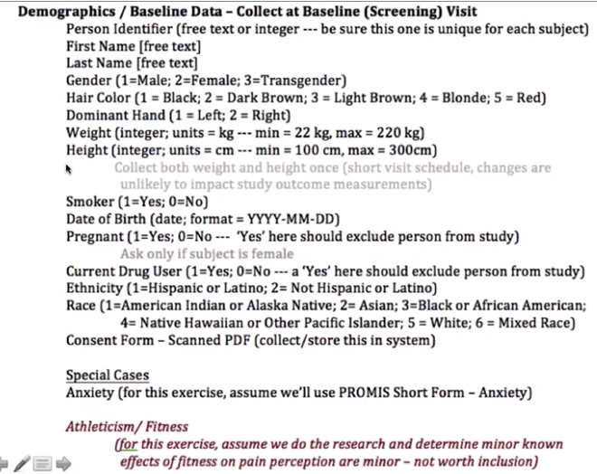
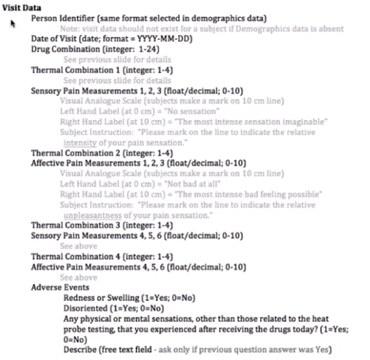

---
jupytext:
  text_representation:
    extension: .md
    format_name: myst
kernelspec:
  display_name: Data Management for Clinical Research 
  language: python
  name: python3
---

# Data Managemet for Clinical Research #

## Week 3 and 4 - Planning a Data Strategy for a Prosepective Study 

## Resources

## Study Procedures: Morphine vs Marinol Study
- Planning a Strategy for EDC
    1. Review study from literature
        - design method and power calculation
    1. Brainstorm about data collection
        - baseline data and Demographics 
            1. look for confounding variables 
                - e.g. hair color vs pain threshold
            1. codify the variables 
            1. consider local context of the study in codification
                - e.g. hispanic vs non-hispanic option for south american study, 5 race options for global study
    1. EDC - create a project + data collection instruments
        1. define the data definitions
            - sample raw demographics forms
            
            
    1. EDC - finalize project design + ready the software
    1. EDC - export data + analysis scripting
    1. Review best practices principles
    
## Mid-Study Activities
- Changes after the initial implementation
    1.  Mid-study data changes
        - examples
            - new science related to study
            - natural events, lab burns, new administration
            - long-running longitudinal study (years)
            - 
        - solution
            - data versioning 
        - tips
            - do not recode options order and value
            - do not remove/delete data
            - be mindful about renaming data field values/codes
            - be mindful about changing meaning of data fields
            - be mindful about adding data
    1.  Interim Reporting Requirements 
        1. Single-Site Clinical Research Study
            - Sponsor (Funding Agency) 
                - Progress Reports
            - IRB Continuing Review (Typically Annual)
                - Participant Enrollment 
                    - to detect over-recruitment
                    - under-recruitment might trigger `stop discussion`
                        - i.e. low power statistical finding
                - Adverse Events
                - Safety Monitoring Rules
            - IRB Immediate Review
                - Adverse Events
                - Protocol Violation
                - Protocol Modifications
                - Key Study Personnel Changes
        1. Multi-Site Clinical Research Study
            - Similar to Single-Site basic reporting needs
            - Data Coordinating Center Operations Report
                - aggregate reporting across sites
                - all-site data audit and quality reporting
                - site assessment reports (recruitment/retnetion reports, deviations)
                
## Dimensions of Data Quality
- Common dimensions
    1. completeness
    1. conformity
    1. trust
    1. coverage
    1. consistency
    1. efficiency
    1. security
    1. timeliness
    1. meaningfulness
    1. scope
    1. precision
    1. conciseness
    1. flexibility
    1. clarity
    1. relevance
    1. accuracy
    1. format
    1. correctness
    1. duplication
    1. integrity
    1. concordance
    1. importance
    1. plausibility
    1. currency
    1. objectivity
    1. reputation
    1. transparency
    1. content
    1. free-of-error
    1. ease-of-use
  
## Design for Missing Data
- Common techniques
    1. don't allow blank fields
        - capture why a value is misisng
    1. accommodate the person entering the data and source of data
        - educational level of encoder, particpants, and study coordinator
    1. make survey easy and straightforward
    1. check blank values
    1. provide options like
        - for categorical variable
            - don't know
            - not applicable
            - decline to answer
            - pending
            - missing
            - missed/not done
            - unknown
        - for continuous variable
            - mapping code for impossible values (i.e. -99)
    1. design and pilto data entry forms
    1. validate surveys
    1. make allowance for `approximate data` 
        - chart abstraction
            - e.g. adverse event date
        - questions relying on patient recall
            - e.g. smoke per day
        - dates
    1. provide way for research to capture approxmiate information
    
## Data Quality Monitoring, Assurance, Audit
- Good Clinical Practice (GCP) assures
    - ensure scientific validity
    - increase public confidence
    - satisfy regulatory requirements
    - reduce future errors
- **2 Main Processes**
    1. Data Integrity Checking
        - `5% error rate` acceptable upper bound
        - checks elements in research are:
            - formatted
            - sensible
            - internally consistent
        - if data generates questionable reuslts:
            - investigate
            - document response
            - resolve/repeat
    1. Source Document Verfication
        - a.k.a `clinical research data auditing`
        - may capture 10x more data errors than integrity test
        - Basic Audit Procedures
            1. Select random records for auditing
            1. print dataset contents into paper audit forms
            1. visit audit site
            1. review available source documents
            1. note any data discrepancies
            1. conduct an exit interview for site personnel
            1. document findings and recommendations
        - ***European Organization for Research and Treatment of Cancer (EORTC) Data Discrepancies Category***
            - Code A error codes and Type
            | Error Code | Error Type |
            | --- | --- |
            |  1  |  None (correct)  |
            |  2  |  minor deviation |
            |  3  | incorrect        |
            |  4  | missing on form or database. |
            |  5  | data on form or database, not in file (no source document) |